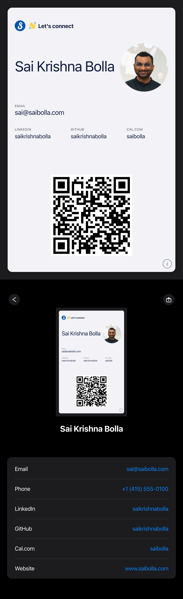

# wallet-card

> Generate a signed Apple Wallet business card pass - tappable contact fields, QR code that opens your LinkedIn (or anything), and a Twemoji-color PNG mockup so you can preview before signing.

A modernization of [lukaskollmer/passcard](https://github.com/lukaskollmer/passcard) (2018) rebuilt on Node 20+, `sharp`, `passkit-generator`, and `qrcode`. No `signpass` binary, no `request`, no `jimp@0.2`.

<p align="center">
  
</p>

## What you get

- **Signed `.pkpass`** ready to AirDrop / email to your iPhone. Tap → "Add to Wallet."
- **Color preview mockup** (`pass-mockup.png`) that renders Twemoji icons in the labels so you can see roughly how it'll look on a device *before* signing.
- **Tappable back-of-pass** - emails open Mail, phone numbers open the dialer, URLs open in their respective apps (LinkedIn, GitHub, etc.).
- **All-config, no hardcoded data** - copy `config/card.example.json` → `config/card.json`, fill in your details, sign.

## Prereqs

- **macOS** (for signing; sharp/passkit-generator run cross-platform but you'll need a Mac to install the Pass Type ID certificate easily).
- **Node 20+**.
- An **Apple Developer account** ($99/yr). You need a Pass Type ID + Pass Signing Certificate.
- A photo of yourself (jpg/png) and optionally a logo image.

## One-time Apple setup (~10 min)

1. **Register a Pass Type ID** at https://developer.apple.com/account/resources/identifiers/list/passTypeId
   - Identifier: `pass.com.yourdomain.something` (must start with `pass.`)

2. **Generate a Certificate Signing Request (CSR)** on this Mac:
   - Open `Keychain Access`
   - Menu: `Keychain Access → Certificate Assistant → Request a Certificate From a Certificate Authority…`
   - Save **to disk** (don't email).
   - This creates the matching private key in your Keychain.

3. **Create the Pass Signing Certificate** on developer.apple.com:
   - Open your Pass Type ID → Configure → Create Certificate
   - Upload the CSR → download the `.cer` file.

4. **Install the cert**:
   ```sh
   security import ~/Downloads/pass.cer -k ~/Library/Keychains/login.keychain-db
   ```

5. **Export cert + key as PEM files** for this project. (The simplest path - let `passkit-generator` use them directly without needing a Keychain-level identity.)

   ```sh
   # Export all identities into a temp p12 (use any password)
   security export -k ~/Library/Keychains/login.keychain-db -t identities -f pkcs12 -P 'passcard' -o /tmp/all.p12

   # Pull out the Pass Type ID cert
   mkdir -p certs
   openssl pkcs12 -in /tmp/all.p12 -nokeys -passin pass:passcard -legacy -out /tmp/certs.pem
   openssl pkcs12 -in /tmp/all.p12 -nocerts -nodes -passin pass:passcard -legacy -out /tmp/keys.pem

   # Isolate just the Pass Type ID cert
   awk '/Pass Type ID:/{flag=1} flag{print} flag && /END CERTIFICATE/{flag=0; exit}' /tmp/certs.pem > certs/pass-cert.pem

   # Match the private key by localKeyID (see scripts/export-cert.sh if you want this automated)

   # Download Apple WWDR G4 intermediate
   curl -o certs/wwdr.cer https://www.apple.com/certificateauthority/AppleWWDRCAG4.cer
   openssl x509 -in certs/wwdr.cer -inform DER -outform PEM -out certs/wwdr.pem
   rm certs/wwdr.cer
   ```

   You should end up with three files in `certs/`:
   - `pass-cert.pem` - your Pass Type ID certificate
   - `pass-key.pem` - its matching private key
   - `wwdr.pem` - Apple's intermediate

## Setup

```sh
git clone https://github.com/saikrishnabolla/wallet-card.git
cd wallet-card
npm install
cp config/card.example.json config/card.json
```

Edit `config/card.json` with your name, email, LinkedIn handle, etc. (See `config/card.example.json` for the full schema.)

Add your photo and (optionally) a logo to `assets/`:

```
assets/
├── photo.jpg     # your headshot, square-ish, jpg or png
└── logo.png      # optional brand mark (or reuse photo.jpg)
```

## Build & sign

```sh
npm run make
```

Outputs:
- `card.pkpass` - the signed pass, ready to put on a phone
- `pass-mockup.png` - color preview of front + back

Or run steps individually:

```sh
npm run build    # Build preview.pass/ from config
npm run sign     # Sign preview.pass/ → card.pkpass
npm run mockup   # Render pass-mockup.png from preview.pass/
```

## Get it on your phone

1. AirDrop `card.pkpass` from Finder to your iPhone, OR
2. Email it to yourself and open the attachment, OR
3. Drop it in iCloud Drive and open it from the Files app.

Wallet shows an "Add to Wallet" prompt. Tap Add. Done.

## Customize

Everything is in `config/card.json`. Notable bits:

- `style.foregroundColor` / `backgroundColor` / `labelColor` - `rgb(r,g,b)` strings.
- `style.logoText` - text next to the small logo image in the top-left. Emojis work (`👋 Let's connect`).
- `style.qrAltText` - caption under the QR. Leave empty for none.
- `apple.teamIdentifier` - your 10-character Team ID.
- `apple.passTypeIdentifier` - your registered `pass.com.*` identifier.
- `certs.signerCert` / `signerKey` / `wwdr` - paths to the three PEM files.
- `assets.photo` / `assets.logo` - paths to your images.

To change which fields appear on the front (currently Email + LinkedIn/GitHub/Cal.com), edit `scripts/build.mjs` directly. Apple Wallet's generic style only allows **4 fields total** across secondary + auxiliary rows.

## Notes on Apple Wallet limits

- **Generic style**: max 4 combined secondary + auxiliary fields. Going over causes layout cramping (some fields may not display).
- **`attributedValue`** only supports `<a href>` - no ``, no styling tags. Brand icons (LinkedIn `in`, GitHub `octocat`) can't be inlined as images.
- **Emoji labels** *do* render (Wallet uses Apple Color Emoji as font fallback). The mockup uses Twemoji for parity.
- **Back-of-pass styling** is system-controlled. You author `backFields` (label + value + optional `attributedValue` URL), iOS renders the chrome (dark background, mini-preview, share button, group container).

## Project structure

```
.
├── config/
│   ├── card.example.json   # Template - copy to card.json
│   └── card.json           # Your config (gitignored)
├── assets/                 # Your photos/logos (gitignored)
├── certs/                  # Your signing certs (gitignored)
├── scripts/
│   ├── build.mjs           # Builds preview.pass/ from config
│   ├── sign.mjs            # Signs preview.pass/ → .pkpass
│   └── render-mockup.mjs   # Renders pass-mockup.png
└── preview.pass/           # Intermediate output (gitignored)
```

## Credits

- Original [passcard](https://github.com/lukaskollmer/passcard) by [Lukas Kollmer](https://lukaskollmer.me) - MIT
- [passkit-generator](https://github.com/alexandercerutti/passkit-generator) by Alexander Cerutti - handles the actual `.pkpass` signing
- [Twemoji](https://github.com/twitter/twemoji) - color emoji SVGs for the mockup
- Apple's [WWDR G4](https://www.apple.com/certificateauthority/) intermediate certificate

## License

MIT - see [LICENSE](LICENSE).
